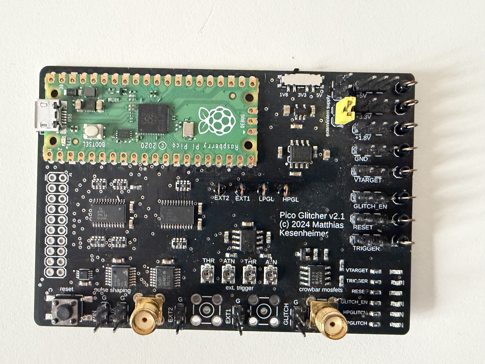

# Pico Glitcher

There are several open source glitchers available already for low budgets (like the Faultier from [Hextree.io](https://hextree.io)). In this page we want to introduce the Pico Glitcher 2  developed by Matthias Kesenheimer, which costs about $64, which is considerable less expensive than professional tools like the [ChipWhisperer-Husky](https://www.crowdsupply.com/newae/chipwhisperer-husky) for $630.

### Overview

The Pico Glitcher uses a **Raspberry Pi Pico** to control a **MOSFET**, which is responsible for generating voltage glitches. The **Findus library** (also known as the _fault-injection-library_) is a Python library that provides the necessary code to perform voltage glitching attacks using the Pico Glitcher.

The Pico Glitcher is under active development. This page is based on **Pico Glitcher version 2.1**. If you are using a newer version, please verify that the information provided here still applies.

<figure><figcaption><p>Pico Glitcher v2.1</p></figcaption></figure>

### Example

#### STM8S

The developer of the Pico Glitcher provides a dedicated target board on his website, allowing users to easily test the Pico Glitcher. This setup uses a **custom-made target board** featuring an **STM8S microcontroller** running **custom firmware**.

The STM8S microcontroller uses its built-in **UART bootloader**, which normally enforces **Read-Out Protection (ROP)** to prevent access to the flash memory. When ROP is enabled, the bootloader should reject read-memory commands sent over UART. The goal of the attack is to **bypass ROP** by injecting a precisely timed voltage glitch while the bootloader checks the ROP status. If the glitch is successful, the protection check is skipped or mis-evaluated, causing the bootloader to incorrectly allow flash memory reads.

Full details of this attack can be found here: [https://fault-injection-library.readthedocs.io/en/latest/examples/#stm8s-glitching](https://fault-injection-library.readthedocs.io/en/latest/examples/#stm8s-glitching)

When you run the attack with this command:&#x20;

```
python stm8-readmemory.py --rpico /dev/ttyACM0  --target /dev/ttyUSB0 --delay 90_000 100_000 --length 90 110
```

In this setup, the Pico Glitcher injects voltage glitches with a delay between **90,000 and 100,000 ns** and a glitch length between **90 and 110 ns**. During execution, many attempts will fail, producing _“read memory command fail”_ errors. Eventually, a successful glitch occurs, allowing the protected memory region to be read and effectively bypassing ROP.

<figure><figcaption><p>Successfull glitch</p></figcaption></figure>

The Pico Glitcher also provides a convenient visualization feature that graphically displays the different glitch attempts, making it easy to identify the timing window in which the glitching attack was successful.

<figure><figcaption><p>Graphical view</p></figcaption></figure>

## Conclusion

In my experience, the Pico Glitcher is a very solid choice for getting started with voltage glitching. It is affordable, easy to set up, and still powerful enough to demonstrate real and reproducible fault injection attacks. The combination of clear tooling, an actively maintained library, and practical examples like the STM8S target makes the learning curve much less intimidating. If you want to move from theory to hands-on voltage glitching without immediately investing in expensive professional equipment, the Pico Glitcher is a great platform to begin with and to build confidence before progressing to more advanced setups.
